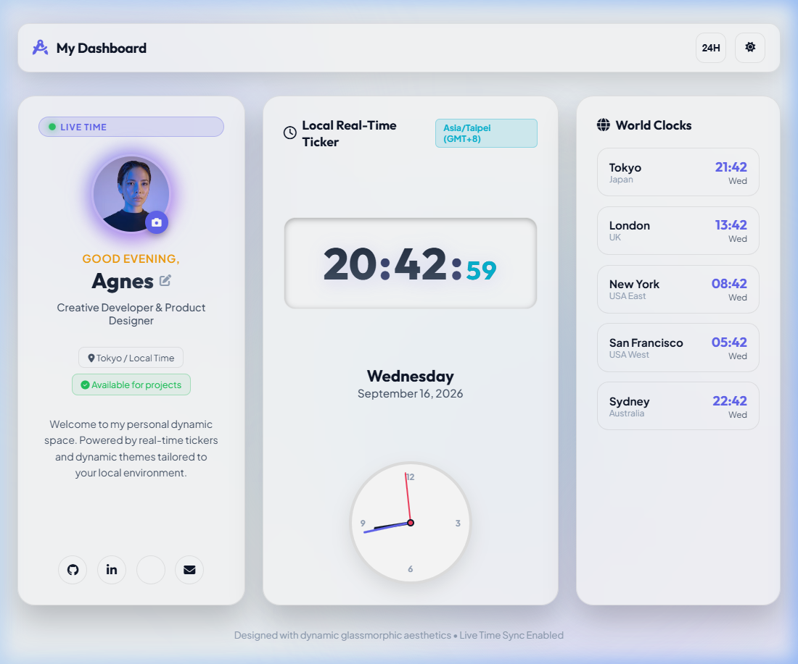

# AIOT-DA Course: Do In Class 1 (DIC-1)
> **Agnes's Personal Dashboard & Real-Time Clock Application**

**Author:** Agnes (Zheng-Sophie)  
**Date:** September 16, 2026  
**Repository:** [https://github.com/Zheng-Sophie/0916-IoT.git](https://github.com/Zheng-Sophie/0916-IoT.git)  
**Live demo：**https://zheng-sophie.github.io/0916-IoT/  



---

## 📌 Project Overview
This repository contains the completed project codebase for **Do In Class 1 (DIC-1)** of the **AIOT-DA** course. The web application serves as a dynamic personal dashboard for **Agnes**, offering real-time clock synchronization, environmental greetings, custom profile editing, world clocks monitoring, and glassmorphic dark/light UI themes.

---

## ✨ Features & Highlights

1. **Personalized Profile Card (Agnes)**
   - Displays Agnes's custom profile header with customizable title, bio, status badges (*"Available for projects"*), and avatar image switcher.
   - Interactive modal dialog to update profile name with persistent `localStorage` saving.

2. **Real-Time Dual Tickers**
   - **Digital Clock**: High-precision digital readout showing hours, minutes, and ticking seconds.
   - **Analog Clock**: Smooth rotational CSS/SVG hands for hours, minutes, and seconds.
   - **Date & Time Zone**: Live day of week, full date, and auto-detected time zone (`GMT+8`).
   - **12H / 24H Toggle**: Instant format switching.

3. **Environment Dynamic Greetings**
   - Calculates local system time to dynamically adjust greetings:
     - 🌅 `Good Morning, Agnes` (05:00 - 11:59)
     - ☀️ `Good Afternoon, Agnes` (12:00 - 16:59)
     - 🌆 `Good Evening, Agnes` (17:00 - 21:59)
     - 🌙 `Good Night, Agnes` (22:00 - 04:59)

4. **World Clocks Panel**
   - Live international time zone tracking:
     - 🇯🇵 **Tokyo** (`Asia/Tokyo`)
     - 🇬🇧 **London** (`Europe/London`)
     - 🇺🇸 **New York** (`America/New_York`)
     - 🇺🇸 **San Francisco** (`America/Los_Angeles`)
     - 🇦🇺 **Sydney** (`Australia/Sydney`)

5. **Glassmorphism Design & Dark/Light Themes**
   - Built with HSL color palettes, frosted glass cards (`backdrop-filter: blur(24px)`), and background glow mesh animations (`@keyframes float`).
   - One-click **Dark / Light Theme** toggle button.

---

## 📁 Repository Structure

```
c:\Users\user\Desktop\L2\
├── index.html                  # Main HTML5 layout & semantic elements
├── styles.css                  # Design system, glassmorphic UI & animations
├── app.js                      # Real-time clock ticker & profile controller logic
├── README.md                   # Renewed project documentation & summary
├── screenshot.png              # Preview screenshot of Agnes's dashboard
└── .agents/
    └── skills/                 # Installed agent skills
        ├── grill-me/
        └── productivity/
```

---

## 🚀 How to Run Locally

### Option 1: Python Local HTTP Server
Run in terminal:
```bash
python -m http.server 8000
```
Open browser at: `http://localhost:8000/index.html`

### Option 2: Direct File Open
Open `index.html` directly in any web browser.

---

## 🛠️ Remote Git Repository Status
- **Remote Origin:** `https://github.com/Zheng-Sophie/0916-IoT.git`
- **Main Branch:** `main` (Source code)
- **Live Branch:** `gh-pages` (GitHub Pages auto-deployment)
